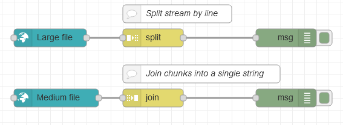

# node-red-contrib-ui-upload

[Node-RED Dashboard](https://github.com/node-red/node-red-dashboard) UI widget node for **uploading** a file content by WebSocket (Socket.io) streaming.

Supports: browse for file or drag & drop; pause & resume, replay; custom chunk size; backpressure.

Screenshot in the Node-RED Dashboard:

In a Node-RED flow, this *Upload node* can advantageously be connected to some standard nodes such as:
* *Split node* using the option *Handle as a stream of messages*: to read one line at a time (works well, also for very large uploaded files)
* *Join node* using the *automatic* mode: to reassemble the uploaded chunks into one single message / string (only for relatively small uploaded files, which can fit in memory)

Example: [flows.json](doc/flows.json)

## Backpressure

This node supports *backpressure* / *flow control*:
it can wait for a *tick* before uploading the next chunk of data,
to make sure the rest of your Node-RED flow is ready to process more data, instead of risking an out-of-memory condition.

For that, just send `{ tick: true }` to the node for triggering the upload of the next chunk of data.

By default, in absence of wired input on this node, a tick will be automatically generated upon full reception of a chunk of data to trigger the upload of the next one.

This backpressure mechanism also gives time to other nodes communicating on the same shared WebSocket and avoids disconnections when uploading large files.

## Credits

License: [Apache 2.0](LICENSE.md), 2020.

Originally made by [Alexandre Alapetite](https://alexandra.dk/alexandre.alapetite) at the [Alexandra Institute](https://alexandra.dk).
