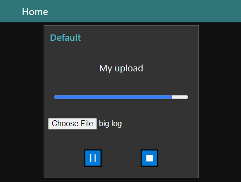
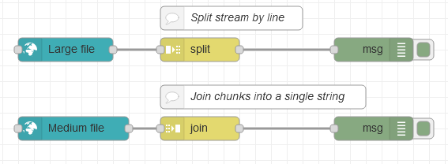

# node-red-contrib-ui-upload

[Node-RED Dashboard](https://github.com/node-red/node-red-dashboard) UI widget node for **uploading** a file content by WebSocket (Socket.io) streaming.

Supports: browse for file or drag & drop; pause & resume, replay; custom chunk size; backpressure.

Meant to be combined with [node-red-contrib-chunks-to-lines](https://github.com/alexandrainst/node-red-contrib-chunks-to-lines).

Screenshot in the Node-RED Dashboard:

In a Node-RED flow, this *Upload node* (using *text* transfer type) can advantageously be connected to some standard nodes such as:

* *Split node* using the option *Handle as a stream of messages*: to read one line at a time (works well, also for very large uploaded files)
* *Join node* using the *automatic* mode: to reassemble the uploaded chunks into one single message / string (only for relatively small uploaded files, which can fit in memory)

Example: [flow.json](examples/flow.json)

But this node really shines when combined with the [node-red-contrib-chunks-to-lines](https://github.com/alexandrainst/node-red-contrib-chunks-to-lines) node, which can split in a more efficient way, e.g. safe for Unicode and with built-in backpressure for automatic buffering optimisation.

Example: [flow.json](https://github.com/alexandrainst/node-red-contrib-chunks-to-lines/blob/main/examples/flow.json)

See also a more advanced [example of upload of a large CSV file to an SQL database](https://flows.nodered.org/flow/687918dd5cb66a3bfc2a661e15ef4237).

## Transfer types

* When using *binary* transfer type, the data is uploaded as chunks of byte arrays. This mode can safely transmit any type of file, but requires a transformation before further use (which [node-red-contrib-chunks-to-lines](https://github.com/alexandrainst/node-red-contrib-chunks-to-lines) can handle).
* When using *text* transfer type, the data is uploaded as chunks of ASCII (more precisely Windows-1252 encoding). This mode is **not able** to properly transmit non-ASCII data such as multibyte strings (e.g. Unicode / UTF-8) or binary files, but is convenient for basic ASCII text.

## Backpressure

This node supports *backpressure* / *flow control*:
it can wait for a *tick* before uploading the next chunk of data,
to make sure the rest of your Node-RED flow is ready to process more data, instead of risking an out-of-memory condition.

To make this behaviour potentially automatic (avoiding manual wires), this node declares its ability by exposing a truthy `node.tickConsumer` for downstream nodes to detect this feature.
Using this approach, the backpressure is done automatically when using the [node-red-contrib-chunks-to-lines](https://github.com/alexandrainst/node-red-contrib-chunks-to-lines) node.

For a manual approach, just send `{ tick: true }` to the node for triggering the upload of the next chunk of data.

By default, in absence of wired input on this node, a tick will be automatically generated upon full reception of a chunk of data to trigger the upload of the next one.

This backpressure mechanism also gives time to other nodes communicating on the same shared WebSocket and avoids disconnections when uploading large files.

## Credits

License: [Apache 2.0](LICENSE.md), 2020-2022.

Originally made by [Alexandre Alapetite](https://alexandra.dk/alexandre.alapetite) at the [Alexandra Institute](https://alexandra.dk).
